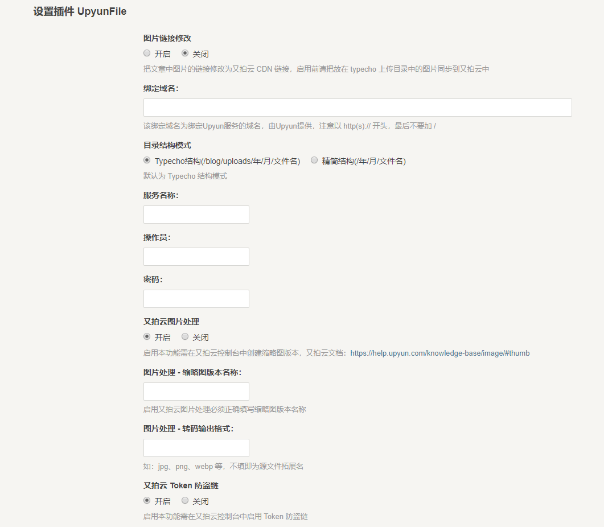

UpyunFile
=========

 又拍云文件管理插件Typecho版

####插件简介：

 本插件基于 [codesee/UpyunFile](https://github.com/codesee/UpyunFile) 二次开发，解决了原作的一些 bug，并加入了新功能。
   
####插件功能：

  1. 上传、修改和删除功能
  2. 静态资源接入又拍云 CDN
  3. 一键替换当前博客中所有图片的 URL 为 CDN 加速链接
  4. 接入又拍云图片处理
  5. 为博客静态资源加入 Token 防盗链
  
  

####使用方法：

  1. 在 [Release](https://github.com/ShadowySpirits/UpyunFile/releases) 中下载此插件的最新版，上传至网站的/usr/plugins/目录下；
  2. 启用该插件，正确填写相关信息，保存即可。
  3. 详细使用以及其他技巧见此文：https://blog.sspirits.top/archives/new-version-of-UpyunFile-plugin-use-tutorial

####更新记录：

**2019-1-20：** 升级 SDK，修复 Bug，加入新功能
  
####鸣谢：
 原作者：[codesee](https://github.com/codesee)
 
 图片链接替换：[benzBrake](https://github.com/benzBrake)
 
 本插件为用户免费自由使用，作者力求插件功能完善，但对使用者涉及的文件内容不承担任何责任。

